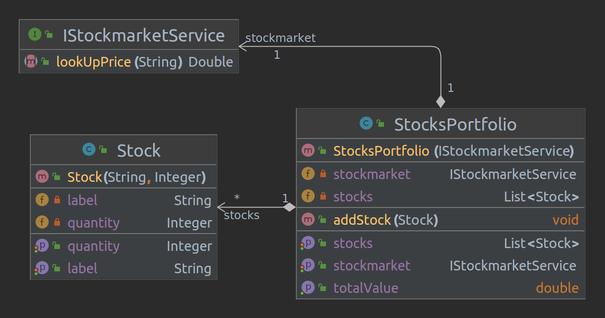
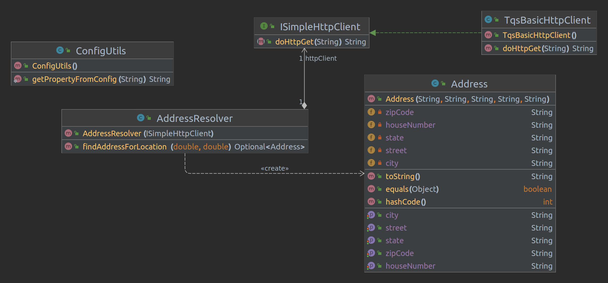

# Lab02 - Mocking dependencias (for unit testing)

# Stocks portfolio
O StocksPortfolio contém uma coleção de Ações, um valor atual da carteira dependente do estado atual do mercado de ações. A imagem seguinte corresponde a classes implementadas para o exercicio.



## POM.XMl
Para implementar os testes unitários, foi necessário adicionar as seguintes dependências ao ficheiro pom.xml:

* JUnit 5
* Mockito
* Hamcrest

```xml
    <properties>
        <slf4j.version>2.0.6</slf4j.version>
        <logback.version>1.4.5</logback.version>

        <junit-jupiter.version>5.9.2</junit-jupiter.version>
        <mockito-junit-jupiter.version>5.1.1</mockito-junit-jupiter.version>

        <maven-surefire-plugin.version>3.0.0-M9</maven-surefire-plugin.version>

        <maven.compiler.source>17</maven.compiler.source>
        <maven.compiler.target>17</maven.compiler.target>
        <project.build.sourceEncoding>UTF-8</project.build.sourceEncoding>
    </properties>

    <dependencies>
        <dependency>
            <groupId>org.slf4j</groupId>
            <artifactId>slf4j-api</artifactId>
            <version>${slf4j.version}</version>
        </dependency>
        <dependency>
            <groupId>ch.qos.logback</groupId>
            <artifactId>logback-classic</artifactId>
            <version>${logback.version}</version>
        </dependency>

        <dependency>
            <groupId>org.junit.jupiter</groupId>
            <artifactId>junit-jupiter</artifactId>
            <version>${junit-jupiter.version}</version>
            <scope>test</scope>
        </dependency>
        <dependency>
            <groupId>org.mockito</groupId>
            <artifactId>mockito-junit-jupiter</artifactId>
            <version>${mockito-junit-jupiter.version}</version>
            <scope>test</scope>
        </dependency>

        <dependency>
            <groupId>org.hamcrest</groupId>
            <artifactId>hamcrest-all</artifactId>
            <version>1.3</version>
        </dependency>
    </dependencies>

    <build>
        <plugins>
            <plugin>
                <groupId>org.apache.maven.plugins</groupId>
                <artifactId>maven-surefire-plugin</artifactId>
                <version>${maven-surefire-plugin.version}</version>
            </plugin>
        </plugins>
    </build>
```

## Test *getTotalValue()*

Este método testa a funcionalidade do método **getTotalValue()** da classe **StocksPortfolio**.

Neste teste, usamos Mockito para criar um Mock da interface IStockMarket, que é usada pelo StocksPortfolio para obter o valor atual de cada ação. Configuramos o mock para retornar um valor de ação fixo para cada ação.

Em seguida, chamamos o método **getTotalValue()** e verificamos se o valor total retornado corresponde ao valor total esperado.

# Geocoding
Um aplicativo que precisa executar geocodificação reserva para localizar um código postal para um determinado ponto de coordenadas de GPS. Este serviço utiliza APIs públicas, exemplo [MapQuest API](https://developer.mapquest.com/documentation/geocoding-api/reverse/get/) para obter o código postal. O serviço é executado em um servidor dedicado e é acessível através de uma API REST.

## Diagrama UML das classes for the geocoding



## **whenResolveDetiGps_returnJacintoMagalhaeAddress**

Este método testa a funcionalidade do método **findAddressForLocation()** quando recebe coordenadas válidas. 

Neste teste, usamos Mockito para criar um Mock da interface ISimpleHttpClient, que é usada pelo AddressResolver para fazer a chamada HTTP para o serviço de geocodificação. Configuramos o mock para retornar uma resposta Json que corresponde a uma solicitação de geocodificação bem-sucedida, com um endereço válido retornado.

Em seguida, chamamos o método **findAddressForLocation()** com coordenadas válidas e verificamos se a resposta retornada corresponde ao endereço esperado.

### **Questão alinea b**
O SuT(subject under test) é a classe *AddressResolver* e o serviço a ser mockado é *ISimpleHttpClient*, responsável por fazer a chamada HTTP para o serviço de geocodificação remota.

## **whenBadCoordidates_thenReturnNoValidAddress**

Este método testa a funcionalidade do método **findAddressForLocation()** quando recebe coordenadas inválidas.

Neste teste, configuramos o mock para retornar uma resposta JSON que indica que uma solicitação inválida foi feita com coordenadas incorretas. Em seguida, chamamos o método **findAddressForLocation()** com coordenadas inválidas e verificamos se a resposta retornada corresponde a um endereço inválido esperado.

## **whenCoordinatesNull_thenReturnExpection**

Este método extra testa a funcionalidade do método **findAddressForLocation()** quando recebe coordenadas nulas.

Neste caso, em vez de usar o Mockito para simular Neste teste, não é necessário configurar um mock porque o método findAddressForLocation() verifica se as coordenadas são nulas antes de fazer a chamada HTTP. Em vez disso, simplesmente chamamos o método findAddressForLocation() com coordenadas nulas e verificamos se uma exceção é lançada.


# Integration
Para implementar um teste de integração, usei a class **AddressResolverIT** dada.

Nesta nova classe de teste, usei uma implementação  real do HttpClient para se comunicar com o serviço de geocodificação remota.

Reutilizei os testes do exercício anterior, para esta nova classe de teste, mas removei qualquer suporte para mocking, para que podese usar a implementação real do HttpClient.

Na forma pedida e para garantir que a execução do teste não falhe devido a problemas de conectividade, usei o plugin maven **failsafe plugin**, tal como pedido.

Por fim, executei os testes pelo terminal com os seguintes comandos: `mvn test` e o `mvn install failsafe:integration-test`.

## **Diferenças entre `mvn test` e o `mvn install failsafe:integration-test`**

O comando `mvn test` executa os testes unitários, enquanto o comando `mvn install failsafe:integration-test` executa os testes de integração do projeto usando o plugin Failsafe do Maven.

O plugin Failsafe é usado para executar testes de integração. O plugin Failsafe é executado após o plugin Surefire, que é usado para executar testes unitários.

O plugin Failsafe é executado quando o comando `mvn install failsafe:integration-test` é executado. O plugin Failsafe executa os testes de integração em um novo ciclo de vida do Maven, chamado de ciclo de vida de integração.


## **Testes de unidade e de integração**

### **Testes de unidade**

Os testes de unidade testam as classes e métodos individualmente, isolando as dependências externas usando mocks ou stubs, e garantem que cada unidade do código funcione corretamente em relação à sua especificação.

### **Testes de integração**

Os testes de integração, por outro lado, testam a interação entre diferentes unidades do sistema, bem como a integração com componentes externos, como bancos de dados, sistemas de arquivos, serviços da web, etc. Eles garantem que o sistema funcione como um todo e que as diferentes partes se comuniquem corretamente.

### **Diferenças entre testes de unidade e de integração**

Portanto, enquanto os testes de unidade podem detectar problemas em uma única unidade do código, os testes de integração são importantes para garantir que o sistema como um todo atenda aos requisitos e funcione corretamente em um ambiente mais realista.

 
# Referencias

* [Mockito](https://site.mockito.org/))<br>
* [Mockito example](https://github.com/bonigarcia/mastering-junit5/tree/master/junit5-mockito))<br>
* [Testing with Hamcrest](https://www.baeldung.com/java-junit-hamcrest-guide)<br>
* [Hamcrest example](https://github.com/bonigarcia/mastering-junit5/blob/master/junit5-assertions/src/test/java/io/github/bonigarcia/HamcrestTest.java)

