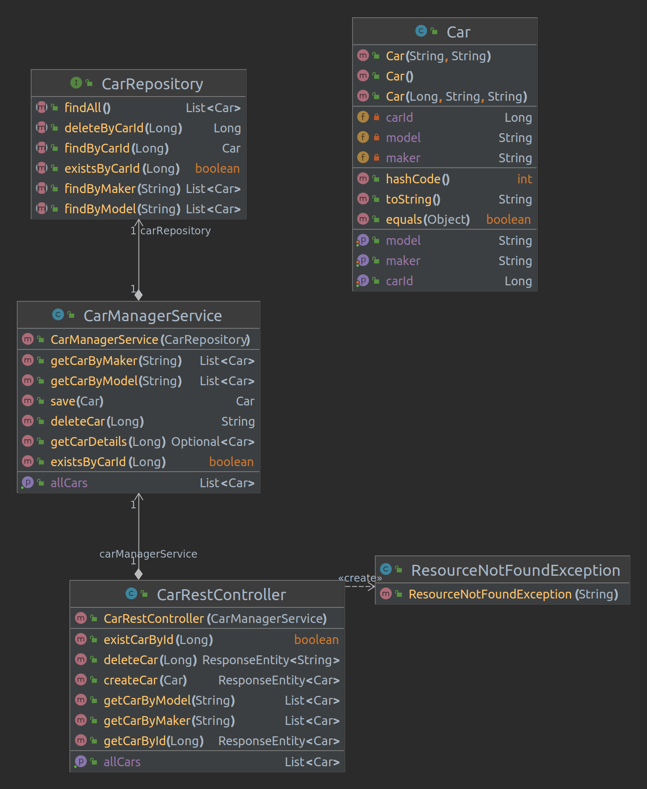

# Lab3 Multi-layer apllication testing (with Spring Boot)

# Employee manager example

## Diagrama UML


## Testes


> You may run individual tests using maven command line options.
> `mvn test -Dtest=EmployeeService*`

## Questions:

1. Identify a couple of examples that use AssertJ expressive methods chaining.

**Resposta**:


2. Identify an example in which you mock the behavior of the repository (and avoid involving a 
database).

**Resposta**:

3. What is the difference between standard @Mock and @MockBean?

**Resposta**:

1. What is the role of the file “application-integrationtest.properties”? In which conditions will it be 
used?

**Resposta**:

5. the sample project demonstrates three test strategies to assess an API (C, D and E) developed 
with SpringBoot. Which are the main/key differences?

**Resposta**:


# Cars Service
> Nesta etapa, o objetivo era criar uma API para um serviço de gerenciamento de carros, utilizando o *Spring Boot*. 


## Configuração de Dependências e Criação de Projeto Spring Boot
Para iniciar o desenvolvimento da API, foi preciso criar um projeto Srping Boot com as seguintes dependências:

- Spring Web
- Developer Tools
- Spring Data JPA
- H2 Database 

> Uma forma rápida e fácil de criar o projeto é utilizar o  [Spring Boot Initializr](https://start.spring.io/), que é uma ferramenta online que permite selecionar as dependências e gerar o projeto com a estrutura básica necessária.
> Caso contrário deve criar um projeto e adicionar as dependências pedidas ao **POM.XML**.

```xml
<dependencies>
        <dependency>
                <groupId>org.springframework.boot</groupId>
                <artifactId>spring-boot-starter-data-jpa</artifactId>
        </dependency>
        <dependency>
                <groupId>org.springframework.boot</groupId>
                <artifactId>spring-boot-starter-web</artifactId>
        </dependency>

        <dependency>
                <groupId>org.springframework.boot</groupId>
                <artifactId>spring-boot-devtools</artifactId>
                <scope>runtime</scope>
                <optional>true</optional>
        </dependency>
        <dependency>
                <groupId>com.h2database</groupId>
                <artifactId>h2</artifactId>
                <scope>runtime</scope>
        </dependency>
        <dependency>
                <groupId>org.springframework.boot</groupId>
                <artifactId>spring-boot-starter-test</artifactId>
                <scope>test</scope>
        </dependency>
</dependencies>
```

## Implementação de Testes 

>Abordando a estratégia **TDD** foi incentivada na implementação do projeto. Os testes foram escritos em uma abordagem de cima para baixo, começando pelo *controller*, depois pelo *service* e depois pelo *repositório*.

Etapas:

1. Para criar um teste para verificar o Car [Rest]Controller e simular o bean CarService, podemos utilizar a biblioteca Mockito para criar um mock do CarService e injetá-lo no Controller. Podemos então testar o comportamento do Controller em relação às chamadas de métodos do CarService. O teste deve ser "resource efficient", ou seja, deve executar o mínimo de recursos possíveis.
        
```java
@WebMvcTest(CarRestController.class)
public class CarController_withMockServiceTest {

@Autowired
private MockMvc mvc;

@MockBean
private CarManagerService service;

@BeforeEach
public void setUp() throws Exception{
}

@Test
void whenPostCar_thenCreateCar() throws Exception{
        Car car = new Car ("Nissan", "Nissan3");

        when(service.save(Mockito.any())).thenReturn(car);

        mvc.perform(
                        post("/api/cars").
                                contentType(MediaType.APPLICATION_JSON).
                                content(JsonUtils.toJson(car))).
                andExpect(status().isCreated()).
                andExpect(jsonPath("$.model", is("Nissan"))).
                andExpect(jsonPath("$.maker", is("Nissan3")));

        verify(service, times(1)).save(Mockito.any());
}
// ... more test
}
```
[Test Controller](Lab3_2/CarsService/src/test/java/pt/ua/deti/tqs/CarsService/CarController_withMockServiceTest.java)

2. Para criar um teste para verificar o CarService e simular o CarRepository, podemos criar um mock do CarRepository e injetá-lo no CarService. Podemos então testar o comportamento do Service em relação às chamadas de métodos do Repository. Este pode ser um teste unitário padrão com mocks.

```java
@ExtendWith(MockitoExtension.class)
public class CarService_UnitTest {

    @Mock(lenient = true)
    private CarRepository carRepository;

    @InjectMocks
    private CarManagerService carService;

    @BeforeEach
    public void setUp() throws Exception{
        Car audi = new Car("A1", "audi");
        audi.setCarId(11L);

        Car bmw = new Car("BMW XM", "BMW");
        bmw.setCarId(12L);

        Car nissan = new Car("Nissan", "Nissan");
        nissan.setCarId(13L);

        List<Car> allCars = Arrays.asList(audi, bmw, nissan);

        Mockito.when(carRepository.save(audi)).thenReturn(audi);
        Mockito.when(carRepository.save(bmw)).thenReturn(bmw);
        Mockito.when(carRepository.save(nissan)).thenReturn(nissan);
        // ....
        }
        @Test
        public void whenSaveCar_thenCarShouldBeSaved(){
                Car audi = new Car(11L,"A1", "audi");
                Car savedCar = carService.save(audi);

                assertThat(savedCar).isNotNull().isEqualTo(audi);

                Mockito.verify(carRepository, VerificationModeFactory.times(1)).save(audi);

                assertThat(savedCar.getCarId()).isEqualTo(audi.getCarId());
                assertThat(savedCar.getModel()).isEqualTo(audi.getModel());
                assertThat(savedCar.getMaker()).isEqualTo(audi.getMaker());
        }
        // MORE Tests
        }
```

[Test Service](Lab3_2/CarsService/src/test/java/pt/ua/deti/tqs/CarsService/CarService_UnitTest.java)

3. Para criar um teste para verificar a persistência do CarRepository, podemos utilizar uma dependência de banco de dados em memória, como o H2. Podemos criar um teste que inicializa uma instância do banco de dados em memória e usa o CarRepository para salvar e buscar um carro.

```java
@DataJpaTest
public class CarRepositoryTest {

    @Autowired
    private TestEntityManager entityManager;

    @Autowired
    private CarRepository carRepository;

    @Test
    void whenFindCarExistingId_thenReturnCar(){
        Car car = new Car("test", "test");
        entityManager.persistAndFlush(car);

        Car fromDb = carRepository.findByCarId(car.getCarId());
        assertThat(fromDb).isNotNull();
        assertThat(fromDb.getModel()).isEqualTo(car.getModel());
        assertThat(fromDb.getMaker()).isEqualTo(car.getMaker());
    }
        // More test
}
```

[Test Repository](Lab3_2/CarsService/src/test/java/pt/ua/deti/tqs/CarsService/CarRepositoryTest.java)


4. Depois de ter todos os testes anteriores passando, podemos implementar um teste de integração para verificar a API. Podemos seguir a abordagem "E/" discutida no projeto anterior (Employees).

```java
@SpringBootTest(webEnvironment = SpringBootTest.WebEnvironment.RANDOM_PORT)
@AutoConfigureTestDatabase 
public class CarRestControllerTemplateIT {
    // will need to use the server port for the invocation url
    @LocalServerPort
    int randomServerPort;

    @Autowired
    private TestRestTemplate restTemplate;

    @Autowired
    private CarRepository carRepository;


    @AfterEach
    public void resetDb() {
        carRepository.deleteAll();
    }

    @Test
    void whenValidInput_thenCreateCar() {
        Car audi = new Car("Audi", "A4");
        ResponseEntity<Car> response = restTemplate.postForEntity("/api/cars", audi, Car.class);

        assertThat(response.getStatusCode()).isEqualTo(HttpStatus.CREATED);

        List<Car> found = carRepository.findAll();
        assertThat(found).extracting(Car::getModel).containsOnly(audi.getModel());
        assertThat(found).extracting(Car::getMaker).containsOnly(audi.getMaker());
    }
        // More test
}
```

[Test Integration](Lab3_2/CarsService/src/test/java/pt/ua/deti/tqs/CarsService/CarRestControllerTemplateIT.java)

## Diagrama UML 
> O diagrama UML abaixo mostra a estrutura do projeto final, acrescentando novos métodos para além dos pedidos.




# Integration test

> Nesta etapa, o objetivo era adaptar o teste de integração para usar um banco de dados real. Para tal, foi necessário executar uma instância do banco de dados MYSQL e garantir a conexão estivesse a funcionar corretamente. Depois, foi adicionada a depência do MySQL e criado e alterado um arquivo de propriedades para usar o banco de dados MySQL.
<br>

Passos para a realização deste exercício foram:

1. Executar uma instância mysql e certificar-se de que pode se conectar usando um contêiner Docker. 
O comando a seguir foi o utilizado para executar a instância do MySQL:

```bash
docker run --name cars_service -e MYSQL_ROOT_PASSWORD=root -e MYSQL_DATABASE=cars_service -e MYSQL_USER=springuser -e MYSQL_PASSWORD=password -p 3307:3306 -d mysql/mysql-server:5.7
```

Este comando inicia uma instância do MySQL com um nome de contêiner "cars_service" e expõe a porta 3307 no host. O banco de dados é criado com o nome "cars_service" e um usuário "springuser" é criado com a senha "password".
<br>

2. Alterar o POM, incluindo a dependência do MySQL.

```xml
<dependency>
        <groupId>mysql</groupId>
	<artifactId>mysql-connector-java</artifactId>
        <version>8.0.27</version>
</dependency>
```
<br>

3. Alterar o arquivo de propriedades- **application-integrationtest.properties** - para usar o banco de dados MySQL. 
No arquivo de propriedades foram colocadas as seguintes linhas de código para especificar as configurações de conexão do banco de dados MySQL:

```properties
spring.jpa.hibernate.ddl-auto=update
spring.datasource.url=jdbc:mysql://localhost:3307/cars_service
spring.datasource.username=springuser
spring.datasource.password=password
```
<br>

4. Na classe de teste, alterar as anotações para indicar que se trata de um teste de integração e para ativar o perfil de configuração de teste de integração.

```java
@SpringBootTest(webEnvironment = SpringBootTest.WebEnvironment.RANDOM_PORT)
// @AutoConfigureTestDatabase // this annotation is not needed because we are using the same database
@TestPropertySource(locations = "/application-integrationtest.properties")
public class CarRestControllerTemplateIT {
        // ...
}
```

Com essas alterações, o teste de integração agora usa um banco de dados MySQL real em vez de um banco de dados em memória.


# Referências

[Difference between @Mock and @MockBean in Spring Boot? Example Tutorial](https://javarevisited.blogspot.com/2022/08/difference-between-mock-and-mockbean-in.html?m=1)
[spring initializr](https://start.spring.io/)
