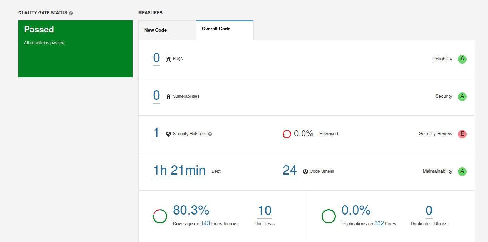
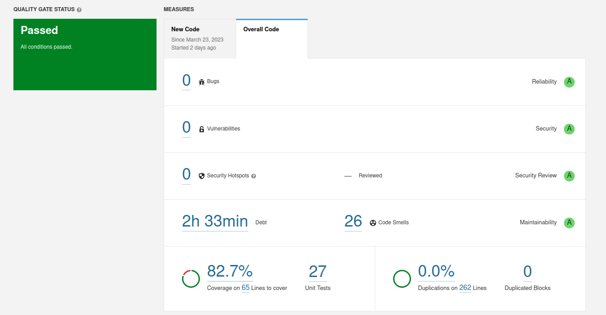
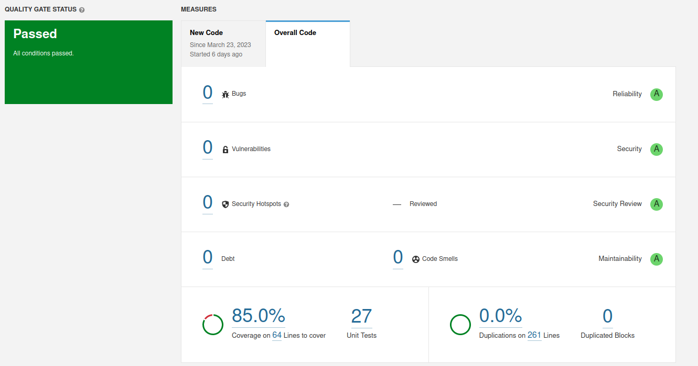
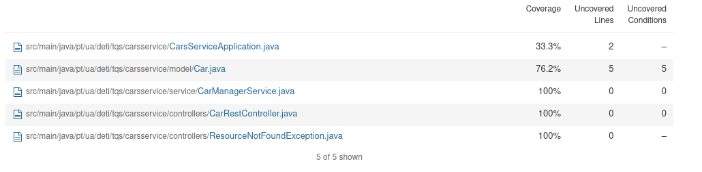

# Lab06 Static Code analysis (with SonarQube)

# Local analysis

1. Inicie o servidor executando:
```bash
docker run -d --name sonarqube -e SONAR_ES_BOOTSTRAP_CHECKS_DISABLE=true -p 9906:9000 sonarqube:latest
```
>[ver mais](https://docs.sonarqube.org/latest/try-out-sonarqube/)
2. Acesse o servidor em [http://localhost:9906](http://localhost:9906)

3. Criar um projeto _"manually"_ , alterar para "Lab06_1" ou "local analysis"

4. **Take note of the generated user token**, [token](/notas.txt)

5. Execute o comando dado para analisar o projeto.
```bash
$ mvn clean verify sonar:sonar \
  -Dsonar.projectKey=local-analysis \
  -Dsonar.host.url=http://localhost:9906 \
  -Dsonar.login=sqp_7c9886b5629f6e7b34d1ba18121cd433a8e48acb

```

6. Acesse o projeto no servidor e veja os resultados.


## Questoẽs

1. Has your project passed the defined quality gate? Elaborate your answer.

_Resposta:_
> Com base nos resultados da análise do _SonarQube_ que se obteve, parece que o projeto dado foi analisado com sucesso e que passou em termos de _defined quality gate_.
> O projeto tinha 0 bugs ou vulnerabilidades, o que é bom para confiabilidade e segurança. No entanto possui 1 security Hotspot, o que sugere que há uma área no código que pode potencialmente levar a uma vulnerabilidade de segurança e que deve ser revisada.A nível de _Maintainability_ existe áreas do código que poderiam ser melhoradas (24 _code smells_). 
> Em relação aos _Unit Tests_m o projeto tem um alcance de 80,3%, o que garaante a qualidade do uso deste código.


2. Explore the analysis results and complete with a few sample issues, as applicable. 

_Resposta:_
No found bugs and vulnerabilities.
 **Issue** | **Problem** | **Description** | **Solution** |
 --- | --- | --- | ---| 
¹ Code smell(major)| The return type of this method should be an interface such as "List" rather than the implementation "ArrayList".| A for loop stop condition should test the loop counter against an invariant value (i.e. one that is true at both the beginning and ending of every loop iteration). Ideally, this means that the stop condition is set to a local variable just before the loop begins.<br> Stop conditions that are not invariant are slightly less efficient, as well as being difficult to understand and maintain, and likely lead to the introduction of errors in the future.<br> This rule tracks three types of non-invariant stop conditions:<br> When the loop counters are updated in the body of the for loop When the stop condition depend upon a method call When the stop condition depends on an object property, since such properties could change during the execution of the loop.  | `for (int i = 0; i < 10; i++) {...}`

¹
```java
Dip randomDip = new Dip();
for (int i = 0; i < NUMBERS_REQUIRED; ) {
  int candidate = generator.nextInt(NUMBERS_RANGE_MAX) + 1;
  if (!randomDip.getNumbersColl().contains(candidate)) {
    randomDip.getNumbersColl().add(candidate);
i++;
```


> Correção de alguns _code Smell_.


# Technical debt (Cars)
O comando dado para analisar o projeto.

  ```bash 
  mvn clean verify sonar:sonar \
    -Dsonar.projectKey=cars \
    -Dsonar.host.url=http://localhost:9906 \
    -Dsonar.login=sqp_14de22769355d2ef94436460cc304e1a33f6a4c0
  ```
## Alinea A
a) **Technical debt** é uma das considerações mais importantes a ter em mente ao lidar com projetos de software complexos. Trata-se de uma medida do esforço estimado necessário para corrigir os problemas de base de código identificados no código durante a análise, ou seja,  uma medida de comprometimento na qualidade do código feito para compensar cronogramas de entrega rápida. 

A ferramenta de **SonarQube** trata-se de uma das ferramnetas mais populares usadas para análise automatizada de código. Ele fornece uma análise detalhada do código-fonte e gera um relatório com as principais métricas de qualidade do código, incluindo cobertura de testes, complexidade e Technical debt.


De acordo, com a imagem acima, podemos ver que a Technical debt é de 2 horas e 33 minutos, o que significa que são necessárias mais de duas horas de trabalho para corrigir todos os problemas identificados na análise. 

## ALinea C
Code coverage reports requires the Jacoco plugin. 
```xml 
<plugin>
    <groupId>org.jacoco</groupId>
    <artifactId>jacoco-maven-plugin</artifactId>
    <version>0.8.8</version>
    <executions>
      <execution>
        <goals>
          <goal>prepare-agent</goal>
        </goals>
      </execution>
      <execution>
        <id>report</id>
        <phase>prepare-package</phase>
        <goals>
          <goal>report</goal>
        </goals>
      </execution>
    </executions>
  </plugin>
</plugins>
```



## Alinea B
Tendo em conta a imagem em cima, sabaemos que o codigo não tem nenhum bug, vulnerabilidade e nem security hotspots e 26 code smells.
Desses 26 code smells:
- x major
- x blocker
- x minor
- x info

(concluir)

## ALinea D
**Run the static analysis and observe/explore the coverage values on the SonarQube dashboard.How many lines are “not covered”? And how many conditions?**



# Custom QG


# Reference
[https://docs.sonarqube.org/latest/user-guide/user-account/generating-and-using-tokens/](https://docs.sonarqube.org/latest/user-guide/user-account/generating-and-using-tokens/)